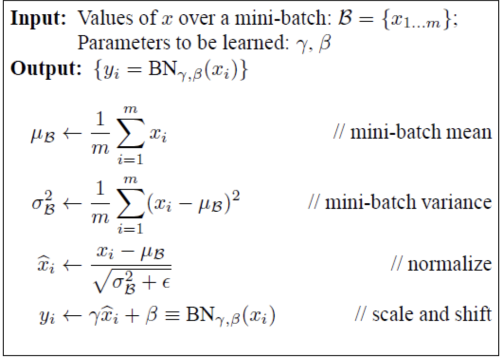

# 1.Batch Normalizaion

     1-1 gradient vanishing/exploding 문제

      Sigmoid 혹은 hyper tangent 등의 비선형포화함수를 사용하면 미분값이 0에 가까워진다.
      역전파 학습시, chainrule에 의해 계속된 곱연산은 gradient를 0으로 만듬

      지금까지는 activation 함수 중 하나인 Relu를 사용하여 완화하긴 했지만 근본적인 해결책이 아닌 간접적 회피
      망이 깊어지만 여전히 문제가 되며, 드롭아웃이나 regularizaition 또한 완벽한 해결이 될 수 없다.

      -> 훈련 초기 단계에서 문제를 회피할 수 있지만, train 과정에서 다시 문제가 발생하지 않으리란 보장이 없다.

      : batch normalizaion을 통해 학습과정을 안정화시키고 학습속도를 가속

    1-2 Covariate shitf

      mini-batch SGD(stochastic gradient desent) 방식이 효율적이이지만 hyperparameter 설정이 매우 중요하다.
      그 중 초기값과 learing rate는 매우 중요한 파라미터.
      현재 layer input은 이전 layer 파라미터의 영향을 받기 때문에 작은 파라미터라도 망이 깊어지면 그 후 layer에 큰 영향을
      끼칠 수 있다.
      -> 이전 layer의 파라미터에 의해서 현재 layer input의 분포가 바뀜 = Covariate shitf

    1-3 whitening

      Covariate shitf 문제를 줄이는 방법 중 하나가 입력을 whitening 시키는 것
      입력을 평균 0, 분산 1 인 데이터로 정규화시킴.

      하지만 계산량이 많고 일부 파라미터가 무시될 수 있다. (whitening 과정과 backpropa 과정은 무관하여 특정
      파라미터가 계속 커지며 whitening이 진행될 수 있음)

      이러한 단점을 보완하고, Covariate shitf 문제를 해결하기 위해서 BN(batch Normalizaion)을 사용

# 2.알고리즘
  
